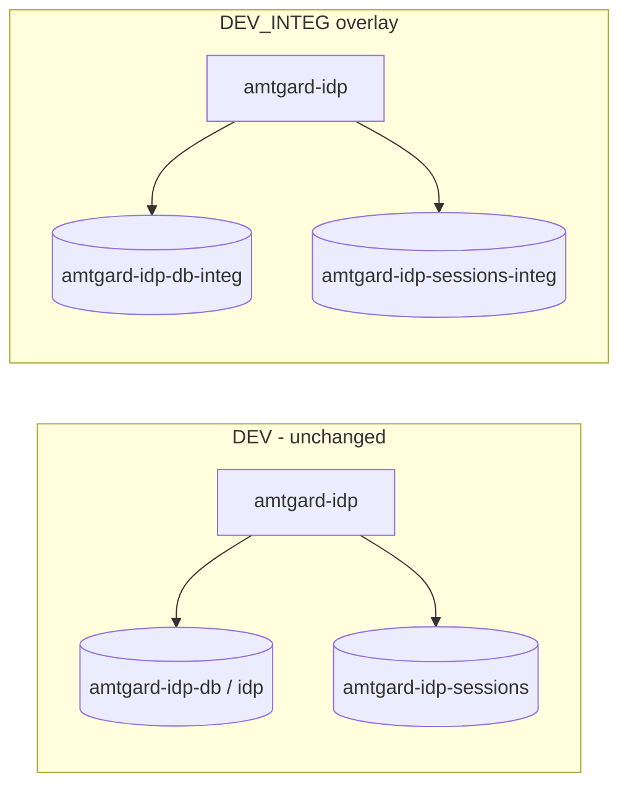

# DEV integ — full coverage plan

Companion to [dev-integ-milestones.md](./dev-integ-milestones.md) (stack 1–14, happy-path smoke). This plan adds **isolated infra**, **per-test DB/session hygiene**, and **route-level coverage** via a second agent queue.

Orchestrator checklist: [dev-integ-coverage-checklist.md](./dev-integ-coverage-checklist.md).

## Goals

1. **Readable runs** — every integ run prints TestDox titles with ✔/✘ (via `./scripts/integ.sh` → `composer integ -- --testdox`).
2. **No cross-test pollution** — tests must pass in **any PHPUnit order**; no test may assume another test’s OAuth consent, social login, or created clients.
3. **Dev safety** — integ uses **dedicated MariaDB and Redis** (separate containers + volumes). `integ-down` restores the app to **DEV** + dev `DB_HOST` / `SESSION_REDIS_HOST` without dropping dev data or flushing dev Redis.
4. **Coverage** — map every public route in `config/routes.php` to at least one integ case (happy or intentional negative), plus documented exclusions.

## Current state (after stack 1–14)

| Layer | Today |
|--------|--------|
| App | Same web container; overlay toggles `ENVIRONMENT=DEV_INTEG`. |
| DB | Same `amtgard-idp-db` container; schema **`idp_integ`** vs dev **`idp`**. |
| Redis | Same `amtgard-idp-sessions`; prefix **`INTEGSESS:`** during integ only. |
| Tests | 21 PHPUnit cases; many are **multi-step scenarios** inside one method. |
| Seed | Once per `integ-up`; **no reset between tests** → order-dependent flakes. |

Pub/sub Redis (PVH cache + queues) is isolated in **D10**: integ overlay sets `REDIS_PUBSUB_HOST=amtgard-idp-sessions-integ` and integ-only queue names; jwt-worker uses `compose.worker.integ.yml` during `./scripts/integ.sh`.

## Architecture target

- **integ-up**: start `amtgard-idp-integ` compose project (DB + Redis only, or DB + Redis + optional worker profile), apply web integ overlay with `DB_HOST` / `SESSION_REDIS_HOST` pointing at integ services, migrate + seed **integ DB only**, flush **integ Redis only**.
- **integ-down**: recreate web stack **without** integ overlay (DEV env from `.env`), verify real Guzzle + dev DB host; **leave integ containers stopped** (or running but unused) — do **not** `docker volume rm` dev volumes.

## Phase C — Isolation & harness (do before expanding scenarios)

| # | Branch | Deliverable |
|---|--------|-------------|
| C0 | `stack/dev-integ-c0-integ-zero-warnings` | **Zero PHPUnit runner warnings** on `./scripts/integ.sh`: fix duplicate `--testdox` (keep flag only in `composer.json` `integ` script, not again in `integ.sh`). Gate: summary ends with `OK (21 tests)` and exit code 0; optional `phpunit.integ.xml` `failOnWarning="true"` once clean. |
| C1 | `stack/dev-integ-c1-integ-infra-compose` | `docker/compose.integ-infra.yml`: MariaDB (`amtgard-idp-db-integ`, volume `amtgard-idp-integ-data-db`, host port e.g. `36307`), Redis (`amtgard-idp-sessions-integ`, volume `amtgard-idp-integ-session-data`). Project name `amtgard-idp-integ`. Document env vars in README. |
| C2 | `stack/dev-integ-c2-integ-wire-hosts` | `compose.integ.yml` + `integ-up.sh` / php-fpm pool: `DB_HOST=amtgard-idp-db-integ`, `DB_NAME=idp` (single schema on integ server), `SESSION_REDIS_HOST=amtgard-idp-sessions-integ`, drop `idp_integ` creation on dev DB container. `integ-down.sh` restores dev hosts from `.env`. Smoke: dev `idp` row count unchanged after full `integ.sh`. |
| C3 | `stack/dev-integ-c3-per-test-reseed` | `IntegTestCase` (or PHPUnit extension): **`setUp()`** runs `seed.php` (host via `docker exec` or PDO purge+seed using `phpunit.integ.xml` env for integ DB port). Optional: flush integ session Redis DB in same hook. All integration tests extend it. Gates: `composer integ` green when tests run in **`--order-by=random`**. |
| C4 | `stack/dev-integ-c4-route-matrix-doc` | `agent/cursor/dev-integ-route-matrix.md`: table Route × Mode (A/B) × Covered (y/n/excluded) × Test class. Exclusions: `POST /oauth/authorize` (empty 200), mailbox (no routes). |

**Done when:** `./scripts/integ.sh` passes twice in a row with `--order-by=random`; dev DB/Redis untouched (manual or scripted assertion).

## Phase D — Coverage expansion (one milestone per agent)

Each milestone: one stacked branch, one commit, extend `tests/Integration/`, update route matrix row(s), `composer test` + `./scripts/integ.sh`. Prefer **one scenario per test method**; use **unique** client ids / emails when creating data to avoid collisions even if reseed regresses.

| # | Branch | Scope |
|---|--------|--------|
| D1 | `stack/dev-integ-d1-static-docs` | `GET /`, `/swagger`, `/docs`, `/docs/readme.md` — 200 and expected content markers. |
| D2 | `stack/dev-integ-d2-auth-negatives` | CSRF missing on login/register; logged-out `GET /resources/profile` → redirect/401; Bearer on cookie route → 401. |
| D3 | `stack/dev-integ-d3-connect-register` | `GET /auth/connect` + `POST /auth/connect/register` happy path (JWT mint helper in fixtures). |
| D4 | `stack/dev-integ-d4-oauth-errors` | Invalid `client_id`, bad `redirect_uri`, wrong `state` after allow; token endpoint wrong secret / bad code (401/400). |
| D5 | `stack/dev-integ-d5-oauth-scopes` | Authorize with scope not allowed for client (if applicable) or empty scope behavior. |
| D6 | `stack/dev-integ-d6-resources-clients-ui` | Logged-in player `GET /resources/clients` 200; admin path already in M11 — assert player sees subset. |
| D7 | `stack/dev-integ-d7-management-update` | `POST /management/clients/{id}` update name/metadata; negative non-admin. |
| D8 | `stack/dev-integ-d8-client-iam-negatives` | Policy claim malformed provisos → 4xx; metadata wrong `login_id` → 404; cross-client isolation. |
| D9 | `stack/dev-integ-d9-low-latency-validate` | Document whether `/resources/validate` (LowLatency) differs from Bearer validate; integ both if distinct. |
| D10 | `stack/dev-integ-d10-pvh-happy` | After token issue, exercise path that touches real Redis PVH without 409 on fresh token (deferred in M13). |
| D11 | `stack/dev-integ-d11-split-megatests` | Split large methods (OAuth approve, Client IAM, Management) into **one concern per test method** for clearer TestDox output; keep total HTTP assertions. |
| D12 | `stack/dev-integ-d12-junit-artifact` | Optional: `integ.sh` writes `build/integ-junit.xml`; short summary line `N passed, M failed` at end. |

D10 landed integ pub/sub on the C1 session Redis container (DB 0 for PVH; session prefix DB unchanged).

## Agent orchestration rules

- Serial queue from [dev-integ-coverage-checklist.md](./dev-integ-coverage-checklist.md); same rules as branch-orchestrator (no push unless user asks).
- **C1–C3 before D\*** — coverage agents assume per-test reseed and dedicated infra.
- Workers return: status, branch, commit, gate summary (`composer test`, `./scripts/integ.sh`, random order when C3 done).

## Test design rules (all phases)

- **Mode A**: one `IntegHttp` per test method; never static/shared jar across methods.
- **Mode B**: separate `IntegHttp` without cookies; Basic/Bearer only.
- **Do not** rely on PHPUnit execution order.
- **CSRF**: fresh token from the form that owns the POST (already standard in milestones doc).
- Count **cases** for reporting: prefer more TestDox lines (split tests) over fewer giant methods.

## Exclusions (unchanged)

- `POST /oauth/authorize` (empty 200).
- Outbound real Google/Facebook/Discord/Apple/ORK (must stay on `DevIntegHttpClient`).
- Mailbox / SMTP until product exposes routes and container keys.
