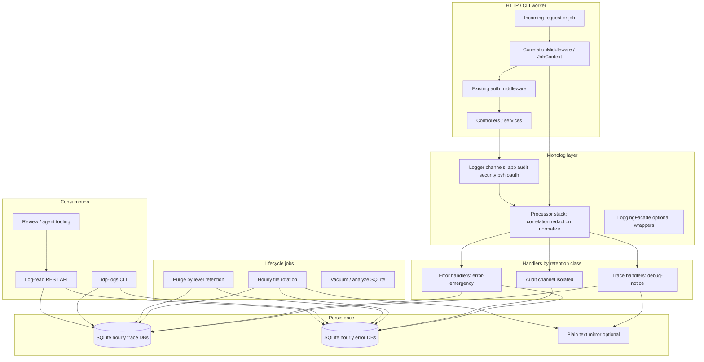

# Logging Spike — Design Plan

**Repository:** `amtgard-idp` (PHP 8.4, Slim 4, Monolog 3, PHP-DI)  
**Document type:** Design only — no implementation in this spike  
**Date:** 2026-09-11  
**Audience:** IDP maintainers, ops, IAM/review tooling owners

**Companion:** [instrumentation-checklist.md](./instrumentation-checklist.md) (file:line implementation checklist; see [README](./README.md)).

---

## Executive summary

Production observability today is a **single Monolog channel** (`app`) writing to `logs/app.log` and PHP `error_log`, with a **NOTICE floor in non-debug** environments. That hides the debug/info traces needed to reconstruct a request, and there is **no correlation ID**, **no redaction policy**, **no queryable store**, and **no IAM-governed log-read API**.

This plan defines a **structured, correlated, redacted logging platform** inside the IDP process:

1. **Request-scoped correlation** (`request_id`, `user_uuid`, `client_id`/`aud`) injected on every line via middleware + Monolog processors.
2. **Channel taxonomy** (`app`, `audit`, `security`, `pvh`, `oauth`) with consistent HTTP-semantics mapping (2xx → info, 4xx → error, 5xx → critical+).
3. **Dual persistence:** hourly **SQLite3** databases (primary query surface) plus optional **plain-text** mirrors (grep-friendly, ops fallback).
4. **Differential retention:** trace stream (debug–notice, ~7 days) vs error stream (error+, ~30 days, duplicated from trace for errors).
5. **Inspection tooling** (CLI first, optional internal UI) keyed on `request_id`, identity, time, level.
6. **Log-read API** authorized by **Idp ORN claims** aligned with existing `Idp:0::::IDP/*` resources and wired into review/agent workflows.

Phasing: **spike** (infrastructure + one route slice) → **pilot** (OAuth/security/PVH + workers) → **rollout** (instrumentation sweep + API + retention automation).

---

## Current state

### Logger wiring (`config/container.php`)

```php
$level = ($_ENV['APP_DEBUG'] ?? 'false') === 'true' ? Logger::DEBUG : Logger::NOTICE;
$logger = new Logger('app');
$logger->pushHandler(new WhatFailureGroupHandler([
    new StreamHandler($logDir . '/app.log', $level),
    new ErrorLogHandler(level: $level),
]));
```

| Aspect | Today |
|--------|--------|
| Channels | One (`app`) bound as `LoggerInterface` |
| Handlers | `StreamHandler` + `ErrorLogHandler` only |
| Processors | None (no correlation, redaction, or normalization) |
| Production floor | `NOTICE` — **debug and info are dropped** |
| Storage | Append-only `logs/app.log` on local disk |
| Workers | `bin/jwt-pvh-worker.php` uses the same `LoggerInterface` |

### Middleware and error pipeline (`config/middleware.php`)

- Slim stack: body parsing, JSON parser, session, method override, CORS (LIFO).
- **No** request logging middleware, **no** response status → log level middleware.
- Error middleware logs uncaught exceptions via Slim’s default handler path; `ApiAwareErrorHandler` only switches JSON vs HTML for `/resources` and `/oauth`.
- `NotFoundErrorHandler` emits structured **`notice`** for 404s (method, path, IP, truncated User-Agent) — a good pattern to generalize.

### Sample instrumentation (uneven)

Recent style-refactor work added **structured context** in hotspots:

| Area | Example behavior |
|------|------------------|
| `CsrfMiddleware` | `warning` on CSRF failure (path, method) |
| `ClientRestrictedAuthMiddleware` | `debug` for PVH auth outcome (`user_uuid`, `aud`, `access`) |
| `ClientResourcesController` | `info` on IAM policy claim add/delete |
| `LowLatencyController` | validate reject at debug + notice |
| `PvhAuthorizationGate`, OAuth social callbacks | provider-scoped context, email hashed where used |
| `Optional::orElseThrow` / empty Optional paths | Often **silent** — exception or 401/403 with no preceding log |

`ManagementMiddleware` validates `?key=` against `MANAGEMENT_KEY` with **no audit log** on success or failure.

### IAM / ORN today

- Admin gate: `UserAuthority::isAdmin()` → requirement `Idp:0::::IDP/EditClient` (`IdpFormat` resources: `IDP/EditClient`, `IDP/EditIdentity`).
- Client IAM claims use service prefix + provisos + resource (`ClaimOrnValidator`, `ClientResourcesController`).
- No log-reader ORNs or log API routes exist yet; access-control doc lists mechanisms but not log inspection.

### Gaps vs stakeholder goals

1. Cannot debug a production request from logs alone (missing correlation + debug floor).
2. Validation / Optional failure paths under-logged.
3. No secret-safe logging contract (JWT bodies, tokens, keys at risk in ad-hoc `context` arrays).
4. No searchable retention or API for operators/agents.
5. Google Drive–synced dev paths add **latency and file-lock** risk for SQLite on laptops (called out under risks).

---

## Target architecture



### Design principles

1. **Defaults over ad-hoc:** correlation and redaction happen in processors; callers pass semantic context, not raw HTTP.
2. **Two retention classes:** “trace” (verbose, short) and “error” (durable, duplicated for ERROR+).
3. **Channel = consumer contract:** security auditors read `security` + `audit`; on-call reads `app` + `oauth` errors; PVH ops reads `pvh`.
4. **Fail open on log I/O:** retain `WhatFailureGroupHandler` so request handling never depends on log disk health.

---

## Monolog handler and channel strategy

### Channels

| Channel | Purpose | Typical sources | Default handler set |
|---------|---------|-----------------|---------------------|
| `app` | General request lifecycle, business logic, Optional branches | Controllers, services, repositories | trace + error |
| `audit` | IAM/policy mutations, admin actions, management key use | `ClientResourcesController`, management routes, claim writers | error-only long retention (+ optional syslog forward later) |
| `security` | Authn/authz failures, CSRF, confidential client failures, brute-force patterns | Auth middleware, CSRF, `ConfidentialClientAuthenticator` | error + trace (debug for investigation) |
| `pvh` | Policy hash gate, queue worker, cache seed/evict | `PvhAuthorizationGate`, `JwtPvhRefreshService`, worker | trace + error |
| `oauth` | Authorization server flows, token endpoint, social OAuth | OAuth actions, social callbacks | trace + error |

### DI binding pattern (conceptual)

- `LoggerInterface` → **`app`** channel (backward compatible injection sites).
- Named entries: `LoggerInterface $auditLogger`, `$securityLogger`, etc., or a small `LogChannels` factory.
- Workers set **`job_id`** + inherited **`request_id`** when processing queue messages that originated from HTTP.

### Handler stacks per retention class

**Trace stack** (levels DEBUG → NOTICE, 7-day retention):

- `SQLiteHandler` → `logs/sqlite/trace/YYYY/MM/DD/HH.logs.sqlite` (hourly file)
- Optional `RotatingFileHandler` or `StreamHandler` → `logs/text/trace/YYYY-MM-DD-HH.log` (see tradeoffs)

**Error stack** (levels ERROR → EMERGENCY, 30-day retention):

- `SQLiteHandler` → `logs/sqlite/error/YYYY/MM/DD/HH.logs.sqlite`
- Duplicate ERROR+ records also inserted into trace DB **or** a shared `errors` table in both (design choice: **duplicate row in error DB + mark `error_stream=1` in trace** for single-request joins)

**Audit stack**:

- Same error retention as audit channel; optionally **exclude DEBUG** entirely.

### Level taxonomy — full Monolog vs subset

**Recommendation: use full Monolog level set in storage** (numeric `level` column) but **document an IDP usage profile** so developers do not debate level semantics per line.

| Monolog level | IDP usage profile |
|---------------|-------------------|
| DEBUG | Branch taken / Optional empty / cache hit-miss / JWT validation step (no secrets) |
| INFO | Successful HTTP 2xx completion, successful OAuth step, worker job finished |
| NOTICE | Significant but normal events (404, rate-limit soft signal, config toggles) |
| WARNING | Recoverable anomalies, deprecated paths, CSRF failure, repeated 401 from same IP |
| ERROR | HTTP 4xx returned to client (client fault but operational signal), validation failure exposed as 4xx |
| CRITICAL | HTTP 5xx, uncaught exceptions, data store unavailable |
| ALERT | Security-sensitive failures (token replay, management key brute force) |
| EMERGENCY | Process cannot continue (misconfiguration, keys missing) |

**Subset in production runtime:** env `LOG_TRACE_LEVEL` (default `debug` in spike, `info` in prod pilot) filters **trace stack only**; **error stack always records ERROR+** regardless of trace floor.

---

## HTTP semantics → log level mapping

Applied in **`HttpObservabilityMiddleware`** (response phase) and mirrored in error handlers for uncaught exceptions.

| HTTP outcome | Log level | Channel default | Notes |
|--------------|-----------|-----------------|-------|
| 2xx | INFO | `app` | One summary line per request; detail lines at DEBUG in handlers |
| 3xx | INFO | `app` | Include `Location` host only, not full URL query secrets |
| 404 | NOTICE | `app` | Already done in `NotFoundErrorHandler`; align middleware |
| 401, 403 | ERROR | `security` | Include `failure_reason` enum, not token material |
| Other 4xx | ERROR | `app` or `security` | Map OAuth/token routes → `oauth` |
| 5xx | CRITICAL | `app` | Exception class + message; stack at DEBUG only if `APP_DEBUG` |
| Unhandled exception → 5xx | CRITICAL | `app` | Slim error middleware + explicit `critical` with exception chain |
| Management/key 403 | ALERT | `audit` | Repeated failures → same `request_id` series |

Middleware should **not** downgrade security 401 to info; stakeholder rule is explicit: **4xx → error**.

---

## Correlation ID propagation

### Request ID

- **Header in:** Honor `X-Request-Id` / `X-Correlation-Id` if present and valid (UUID v4 or ULID, max 64 chars); else generate **ULID** (sortable, URL-safe).
- **Header out:** Set `X-Request-Id` on every HTTP response.
- **Storage:** Request attribute `request_id` + `CorrelationContext` (static request-scoped holder reset per request in middleware teardown).

### Identity dimensions

| Field | Source (priority order) |
|-------|-------------------------|
| `user_uuid` | JWT `sub`, session `user_id`, OAuth resource server user id |
| `client_id` / `aud` | JWT `aud`, session `client_id`, OAuth client id |
| `login_id` | Session / token claims when present |
| `route` | Slim route name or pattern |
| `method` | HTTP method |

Populate progressively: correlation middleware sets `request_id` immediately; auth middleware **updates** context when identity becomes known (processor reads latest context at write time).

### Monolog processor stack (order matters)

1. **`CorrelationProcessor`** — adds `request_id`, `user_uuid`, `client_id`, `aud`, `route`, `method`.
2. **`RedactionProcessor`** — scrubs message + context (see below).
3. **`HttpStatusProcessor`** (optional) — adds `http_status` when in response phase.
4. **`IntrospectionProcessor`** (dev only) — file/line; **off in production** to reduce noise and PII surface.

### Worker / queue jobs

- `PvhQueueMessage` JSON should carry optional **`request_id`** from originating HTTP request when enqueued.
- Worker bootstrap: if missing, generate `job_id` (ULID) and set `correlation_root=worker`.
- Log line prefix context: `{ request_id, job_id, queue, message_key }`.

---

## Redaction layer

### Placement

| Approach | Role |
|----------|------|
| **`RedactionProcessor` (primary)** | Last line of defense on all handlers/channels |
| **`SafeLogContext` helper (secondary)** | Encourages typed context builders at call sites (`email_sha256`, not raw email) |
| **Optional Monolog wrapper** | `RedactingLogger` implementing `LoggerInterface` — only if processor misses nested structures |

**Recommendation:** processor-first + gradual adoption of `SafeLogContext` in high-risk areas (OAuth, JWT, management).

### Rules

1. **Denylist keys** (case-insensitive, nested paths): replace value with `"[REDACTED]"` and add `redacted_keys[]` meta once per record.
2. **Pattern scan** on string values: JWT (`eyJ…`), Bearer headers, PEM blocks, `password`, `client_secret`, refresh/access token field names.
3. **Never log:** raw `Authorization` header, full JWT strings, `MANAGEMENT_KEY`, private key paths contents, Apple/Google/Discord client secrets, CSRF tokens, session ids (log **session_id_prefix** first 8 chars only if needed).
4. **Blind encrypted blobs:** fields matching `client_metadata` opaque base64 over N bytes → `[REDACTED_BLOB len=N]`.
5. **Policy JWT `policy` claim:** log **count** and **hash** (sha256), not ORN list, unless audit channel and explicitly allowed for admin audit exports.

### Field denylist (initial)

```
password, password_confirm, new_password, old_password
secret, client_secret, api_key, management_key
authorization, cookie, set-cookie
access_token, refresh_token, id_token, bearer
csrf_token, _csrf_token
private_key, public_key, key_file, OAUTH_PRIVATE_KEY, OAUTH_PUBLIC_KEY
jwt, compact_jwt, token, code, auth_code
apple_key, discord_token, facebook_token, google_token
pvh, policy (default channel — audit may use policy_hash only)
email (prefer email_sha256 in security channel)
query.key (management query param)
```

### Validation failures

Log at **DEBUG** with `{ field, rule, path }` — not submitted values. At **ERROR** when surfaced as 4xx, log `{ error_code, path }` only.

### Optional / `orElseThrow` instrumentation (convention)

Without wrapping every Optional call site:

- **`LogOptional` utility** (design): `orElseThrowLogged($logger, $level, $msg, $ctx, $ex)` for standardized messages.
- Middleware-level auth failures: always log **before** throw (today inconsistent).
- Spike acceptance: catalog top 20 `orElseThrow` sites (auth, JWT, client IAM) and specify required level/message template.

---

## SQLite schema sketch

One **hourly database file** per retention class (or single DB with `stream` column — spike recommends **single DB per hour per stream** to simplify purge).

### Table: `log_entries`

| Column | Type | Notes |
|--------|------|-------|
| `id` | INTEGER PK | Auto |
| `ts` | TEXT ISO-8601 UTC | Monolog datetime |
| `ts_ms` | INTEGER | Optional ms for ordering |
| `level` | INTEGER | Monolog level constant |
| `level_name` | TEXT | DEBUG…EMERGENCY |
| `channel` | TEXT | app, audit, … |
| `request_id` | TEXT | Indexed |
| `user_uuid` | TEXT NULL | Indexed |
| `client_id` | TEXT NULL | Indexed |
| `aud` | TEXT NULL | Often same as client_id |
| `message` | TEXT | Redacted |
| `context_json` | TEXT | JSON object, redacted |
| `extra_json` | TEXT NULL | Processor extras |
| `http_status` | INTEGER NULL | From middleware |
| `route` | TEXT NULL | |
| `duration_ms` | INTEGER NULL | Request timing |

### Indexes

```sql
CREATE INDEX idx_logs_ts ON log_entries(ts);
CREATE INDEX idx_logs_request ON log_entries(request_id);
CREATE INDEX idx_logs_user ON log_entries(user_uuid);
CREATE INDEX idx_logs_client ON log_entries(client_id);
CREATE INDEX idx_logs_level ON log_entries(level);
CREATE INDEX idx_logs_channel ON log_entries(channel);
CREATE INDEX idx_logs_status ON log_entries(http_status);
```

### Writer behavior

- Batch insert in transaction every N records or 100ms (spike tuning) to reduce lock contention.
- WAL mode enabled: `PRAGMA journal_mode=WAL;`
- **Do not** store SQLite under Google Drive sync path in dev — use `LOG_ROOT` outside sync (see risks).

---

## Plain-text mirror (optional)

| Pros | Cons |
|------|------|
| `tail -f`, unix tools, emergency when SQLite corrupt | Double disk; harder differential retention; no structured query |
| Good for spike debugging before CLI exists | Must apply same redaction processor |

**Recommendation:** enable in **spike + staging**; **disable in production** once CLI/API stable, or write **error stream only** to text.

Format: JSON lines (one record per line) matching SQLite columns for easy `jq` filtering.

---

## Rotation, retention, and cleanup jobs

### Hourly rotation

- At **UTC hour boundary**, close current SQLite file, open new path `.../HH.logs.sqlite`.
- Text mirror rotates with same boundary.

### Purge policy (differential retention)

| Stream | Levels kept | Retention | Action |
|--------|-------------|-----------|--------|
| Trace files | DEBUG–NOTICE (+ INFO) | **7 days** | Delete whole hourly files older than cutoff |
| Error files | ERROR–EMERGENCY | **30 days** | Delete hourly files older than cutoff |
| Audit channel rows | NOTICE+ in audit channel | **30 days** (align with error) | Same as error stream or dedicated 90-day stretch goal |

Errors duplicated: written to **both** trace and error DB at ingest (error handler fan-out) so a `request_id` query against trace still shows ERROR lines within 7 days, while error DB holds 30 days.

### Scheduled jobs

| Job | Schedule | Entry point |
|-----|----------|-------------|
| `logs:purge` | Daily 03:00 UTC | `bin/logs-purge.php` or management route behind cron |
| `logs:vacuum` | Weekly | Reclaim space on retained SQLite files |
| `logs:health` | Hourly | Check write permissions, disk free, last write timestamp |

Wire purge into existing **management** cron patterns (`ManagementController::cleanTokens` precedent) or standalone worker.

### Volume estimates and growth assumptions

Assumptions for planning (adjust after spike metrics):

| Phase | Requests/day | Debug lines/req | Info lines/req | Avg row size | Trace/day | Error/day (2% 4xx/5xx) |
|-------|--------------|-----------------|----------------|--------------|-----------|-------------------------|
| Spike (dev) | 500 | 30 | 3 | 800 B | ~13 MB | ~0.5 MB |
| Pilot (staging) | 5,000 | 20 | 3 | 900 B | ~100 MB | ~5 MB |
| Prod (initial) | 50,000 | 15 | 2 | 1 KB | ~850 MB | ~50 MB |
| Prod (steady) | 200,000 | 10 | 2 | 1 KB | ~2.3 GB | ~200 MB |

**7-day trace:** ~6–16 GB at 50k–200k RPD before compression.  
**30-day error:** ~1.5–6 GB at 2–5% error rates.

Mitigations: raise production trace floor to INFO, sample DEBUG on hot paths (`/resources/validate`), cap context JSON size (e.g. 4 KB), async handler queue if SQLite write latency > 5ms p99.

---

## Inspection tooling spec

### CLI: `bin/idp-logs` (primary spike deliverable)

**Commands:**

| Command | Description |
|---------|-------------|
| `tail [--channel app] [--level debug]` | Follow latest hourly file |
| `query --request-id ULID` | Full trace for one request |
| `query --user-uuid UUID [--since 24h]` | User activity |
| `query --client-id ID --aud ID` | Client-scoped |
| `query --level error --since 7d` | Error stream |
| `stats --since 24h` | Counts by level/channel/status |

**Output modes:** pretty (color), `jsonl`, `csv` for agent consumption.

**UX details:**

- Default time window: last 24h; `--since` / `--until` ISO-8601.
- Exit code 1 if no rows (scripting friendly).
- `--redact-off` **disallowed** — tooling reads already-redacted store only.

### Optional internal web UI (pilot+)

- Read-only, mounted under `/management/logs` or `/resources/admin/logs`.
- Protected by **session admin** + **IAM log ORN** (not management key alone).
- Features: request timeline view, filter chips, copy share link with `request_id`.
- No live tail in v1 (CLI preferred); v2 SSE tail for staging.

### Integration with review tooling architecture

Align with existing agent docs under `agent/cursor/` (milestones, smartlog):

- **Review agents** fetch logs via Log-read API using **agent service account** JWT with `Idp:0::::IDP/AnalyzeLogs` (proposed).
- PR / incident workflows: paste `request_id` into review prompt; agent calls `GET /resources/logs/trace/{request_id}`.
- Document correlation header in `api-endpoints-access-control.md` when implemented.

---

## Log-read API and IAM

### Endpoints (design)

Base path proposal: **`/resources/logs`** (OAuth + IDP JWT protected, not public).

| Method | Path | Purpose | Min claim |
|--------|------|---------|-----------|
| GET | `/resources/logs/trace` | Search trace stream | `IDP/ReadTraceLogs` |
| GET | `/resources/logs/errors` | Search error stream | `IDP/ReadErrorLogs` |
| GET | `/resources/logs/trace/{request_id}` | Full correlated trace | `IDP/ReadTraceLogs` |
| GET | `/resources/logs/stats` | Aggregates | `IDP/ReadTraceLogs` |
| POST | `/resources/logs/analyze` | Bounded export for agents (jsonl bundle) | `IDP/AnalyzeLogs` |

**Query params:** `since`, `until`, `level`, `channel`, `user_uuid`, `client_id`, `aud`, `limit` (cap 500), `cursor`.

**Response:** JSON `{ entries: [...], next_cursor }` — entries match SQLite columns.

### Auth middleware stack

1. `CachedJwtLocalIdpAuthMiddleware` or `ClientRestrictedAuthMiddleware` (service clients).
2. **`LogReaderAuthorizationMiddleware`:** resolves user, loads policy, checks ORN requirement for route.
3. Rate limiting (pilot): per-subject token bucket (e.g. 60 req/min analyze, 300 req/min query).

### ORN claim design (ork-iam alignment)

Extend `IdpFormat::getValidResourceMap()` under resource **`Logs`** (or **`IDP/Logs/*`** nested — prefer flat resources matching existing style):

| Requirement string | Intended grantee | Capability |
|--------------------|------------------|------------|
| `Idp:0::::IDP/ReadTraceLogs` | Operators, support | 7-day trace search + request detail |
| `Idp:0::::IDP/ReadErrorLogs` | On-call, security | 30-day error search |
| `Idp:0::::IDP/AnalyzeLogs` | Automation agents, review bots | Bulk export + stats (no `--redact-off`) |
| `Idp:0::::IDP/ExportAuditLogs` | Compliance (future) | Audit channel only |

**Provisos:** use existing `Idp:0::::` admin-style proviso segment unless kingdom-scoped operators are needed later (`:kingdomId::::`).

**Human vs agentic:**

- Humans: assigned `ReadTraceLogs` + `ReadErrorLogs` via user policy claims table (same mechanism as `EditClient`).
- Agents: OAuth client credentials or long-lived service user with **`AnalyzeLogs` only** (no EditClient), IP allowlist optional.

Register claims in `orn-definitions` / `IdpClaim` resource map in implementation phase; spike only documents strings.

### Relation to existing admin claims

| Existing | New logging claims |
|----------|-------------------|
| `IDP/EditClient` | Superset for IAM admins; does **not** auto-grant log read (separation of duty) |
| `IDP/EditIdentity` | Unrelated |

Optional convenience: `EditClient` holders may **delegate** log reader claims to support staff without edit rights.

---

## Instrumentation conventions (rollout)

### Every interesting method

Define **interest** as: external I/O, auth decision, persistence mutation, queue publish/consume, cache miss/hit affecting auth.

Template:

```text
DEBUG  entering {operation} {key identifiers}
INFO   completed {operation} {outcome summary}
ERROR  failed {operation} {reason_code}   // when returning 4xx/5xx
```

### Catch blocks

| Catch type | Level | Context |
|------------|-------|---------|
| Expected domain (`InvalidArgumentException`) | ERROR if 4xx; DEBUG if handled internally | `exception_class`, `reason` |
| Unexpected (`Throwable`) | CRITICAL | + stack at DEBUG in dev only |

### Slim error middleware

Keep logging enabled; ensure `ApiAwareErrorHandler` uses HTTP mapping table and **`request_id`** in context.

---

## Phased milestones

### Phase 0 — Spike (1–2 weeks, design validation)

- [ ] `LOG_ROOT`, correlation middleware, processors (correlation + redaction)
- [ ] SQLite hourly writer for `app` channel trace + error fan-out
- [ ] `HttpObservabilityMiddleware` on `/resources/validate` + one OAuth route
- [ ] CLI `query --request-id`
- [ ] Document env vars and denylist
- **Exit criteria:** Reconstruct one staged request end-to-end from SQLite using only `request_id`

### Phase 1 — Pilot (2–4 weeks)

- [ ] All channels + worker correlation
- [ ] Instrument auth middleware + top Optional/throw sites
- [ ] Purge job + retention tests
- [ ] Log-read API with `ReadTraceLogs` / `ReadErrorLogs`
- [ ] Staging-only text mirror optional
- **Exit criteria:** On-call playbook uses API/CLI for 4xx/5xx incidents without SSH tail

### Phase 2 — Rollout (4–8 weeks)

- [ ] Codebase sweep (controllers, repositories, OAuth)
- [ ] `AnalyzeLogs` for agent workflows; review doc updates
- [ ] Production trace level INFO default; DEBUG sampling on hot paths
- [ ] Dashboards/alerts from error stream (external — Datadog/etc. out of scope unless ErrorLogHandler retained)
- **Exit criteria:** No ad-hoc `error_log` or `var_dump` debugging in production paths

### Phase 3 — Hardening (ongoing)

- [ ] GDPR data subject access/erase linkage for log rows by `user_uuid`
- [ ] Compression/archival to object storage for error stream
- [ ] Performance tuning (async writes, sampling)

---

## Risks

| Risk | Impact | Mitigation |
|------|--------|------------|
| **PII in logs** | Compliance, trust | Redaction processor, denylist, audits of `context` arrays |
| **Volume / disk** | Cost, slow queries | Differential retention, INFO floor, row size caps, sampling |
| **SQLite write latency** | Request tail latency | WAL, batch writes, async handler queue |
| **Google Drive path latency** | Locking, corruption | `LOG_ROOT` on local disk; never sync live SQLite |
| **GDPR / retention** | Legal exposure | Retention job, user_uuid purge API, document lawful basis |
| **Secret leakage via query strings** | Management key, OAuth `code` | Redact query params in middleware; log route only |
| **Dual retention complexity** | Ops confusion | CLI defaults to trace; errors documented; same `request_id` joins |
| **IAM sprawl** | Wrong access | Separate log ORNs from EditClient; agent-specific analyze claim |

---

## Open questions

1. **Single vs dual SQLite file per hour:** one DB with `stream` column vs separate trace/error files — which ops prefers for purge?
2. **Production trace default:** INFO vs DEBUG with sampling — what RPS do we expect on `/resources/validate`?
3. **Audit channel separation:** should IAM claim mutations duplicate into `audit` even when logged at info on `app`?
4. **Centralized log shipping:** keep `ErrorLogHandler` for platform syslog, or replace entirely with SQLite export agent?
5. **Management key routes:** migrate to IAM-only and log to `audit` at ALERT on failure?
6. **Email logging:** global ban except `email_sha256`, or allow domain-only (`*@example.com`) for support?
7. **ork-iam package:** add `IDP/ReadTraceLogs` to shared orn-definitions vs IDP-local only until upstream merge?
8. **Multi-instance deployment:** SQLite is per-host — do we need aggregated search (Loki/ClickHouse) later?
9. **Agent analyze API:** max row count / time window for `POST /analyze` to prevent exfiltration?
10. **Clock skew:** ULID vs UUID v4 for cross-service correlation with existing Amtgard services?

---

## Appendix A — Component checklist (implementation reference)

| Component | Responsibility |
|-----------|----------------|
| `CorrelationMiddleware` | ID in/out, context lifecycle |
| `HttpObservabilityMiddleware` | Duration, status → level summary line |
| `CorrelationContext` | Mutable request-scoped identity |
| `CorrelationProcessor` | Monolog enrich |
| `RedactionProcessor` | Denylist + patterns |
| `SqliteLogHandler` | Hourly rotate, batch insert |
| `LogChannelFactory` | Channel construction in container |
| `LogReaderAuthorizationMiddleware` | ORN checks |
| `LogsQueryService` | SQL builder, caps, cursors |
| `bin/idp-logs` | Operator CLI |
| `bin/logs-purge.php` | Retention enforcement |

---

## Appendix B — Environment variables (proposed)

| Variable | Default | Purpose |
|----------|---------|---------|
| `LOG_ROOT` | `{project}/logs` | Root; must not be cloud-synced |
| `LOG_TRACE_LEVEL` | `debug` / `info` prod | Trace handler floor |
| `LOG_SQLITE_ENABLED` | `true` | Toggle SQLite writer |
| `LOG_TEXT_MIRROR` | `false` prod | Plain-text JSONL |
| `LOG_TRACE_RETENTION_DAYS` | `7` | Trace purge |
| `LOG_ERROR_RETENTION_DAYS` | `30` | Error purge |
| `LOG_CONTEXT_MAX_BYTES` | `4096` | Truncate oversized context |

---

*End of design plan.*
